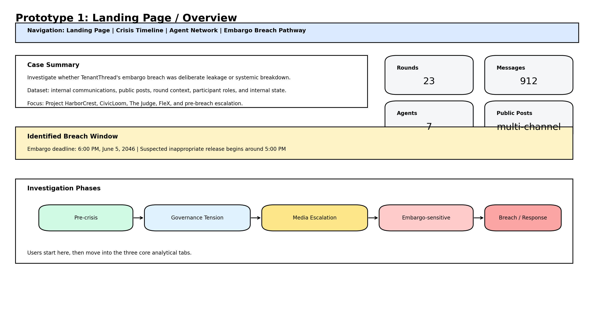
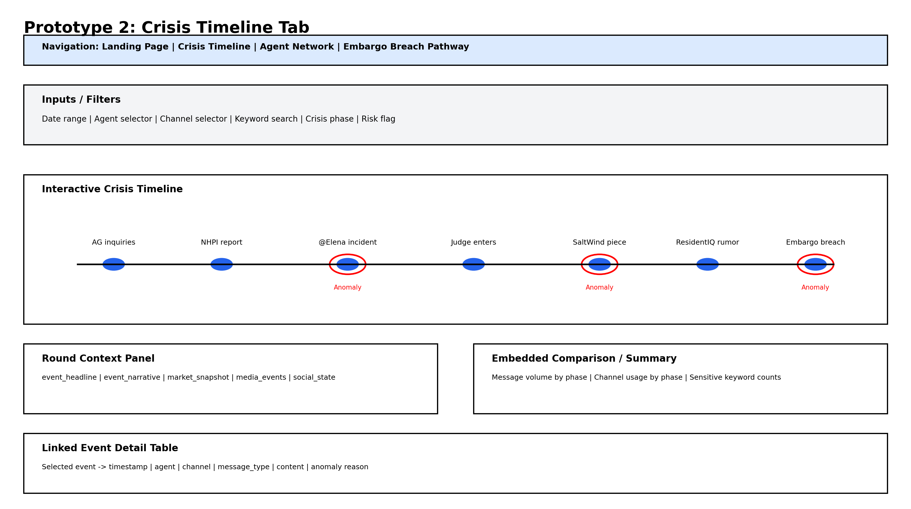
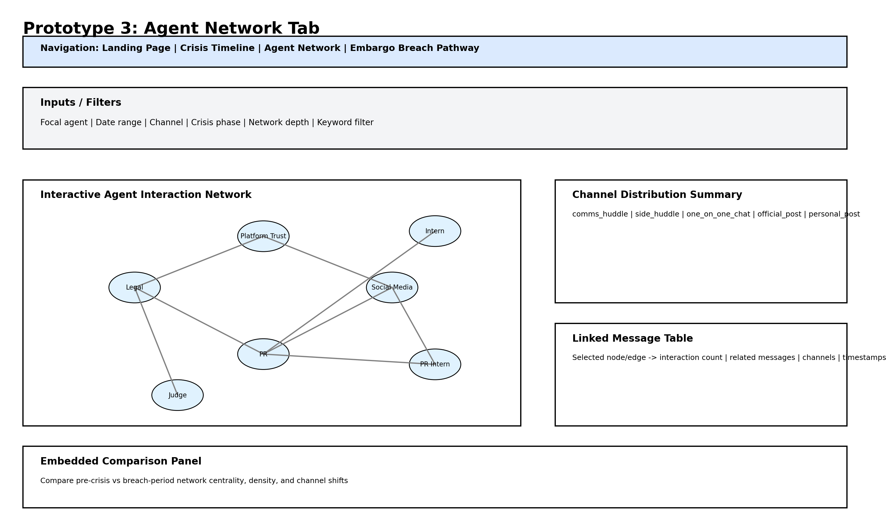
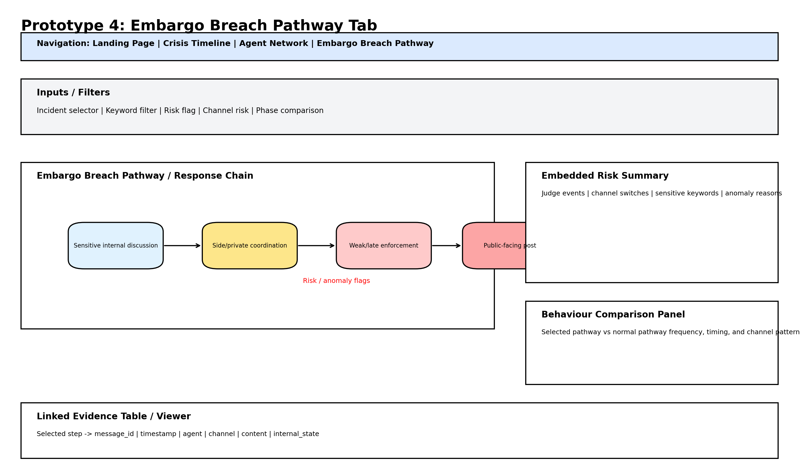

# Motivation

As organisations increasingly rely on AI-enabled communication and compliance systems, sensitive corporate processes are now managed not only by humans but also by automated agents that draft messages, monitor sentiment, route approvals, and enforce disclosure rules. While these systems improve efficiency, they also create new risks when multiple agents, workflows, and decisions interact under pressure. This project is motivated by the case of TenantThread, a property technology company whose Retention Optimizer scores tenants using payment timing, maintenance requests, and message tone. Although the company publicly claimed its data was anonymised, internal communications suggest that tenants in smaller properties could still be re-identified through cross-referencing.

At the same time, TenantThread had entered a confidential merger agreement with CivicLoom Realty Partners under the codename Project HarborCrest, with a strict embargo until 6:00 PM on June 5th, 2046. Despite the presence of an automated compliance tool called The Judge, embargoed information about the merger appeared publicly on FleX around 5:00 PM. This makes the case important not only because a leak occurred, but because the cause is unclear: it may have resulted from deliberate human action, abnormal AI-agent behaviour, weak embargo enforcement, or a broader coordination failure. A Shiny-based visual analytics application is therefore well suited to support the investigation by helping users reconstruct the timeline of events, analyse agent interactions, compare normal and abnormal behaviour, and trace how embargo-sensitive information moved from internal communications to public release.

# Problem Statement

TenantThread's internal communication and automated response systems released embargoed merger information before the official disclosure time, despite the presence of an embargo enforcement mechanism. The cause of this breach is unclear.

The central problem addressed by this project is: **Did TenantThread deliberately leak the merger information, or did the system break down under operational, reputational, and social media pressure?**

To answer this question, investigators must analyse internal communications from the two weeks leading up to the breach and understand:

-   what key events occurred before the breach
-   which actors, agents, systems, and channels were involved
-   where major decision points and compliance failures occurred
-   how embargo-sensitive information moved across communication boundaries
-   how breach-related behaviour differed from prior normal behaviour
-   whether there were leading indicators that such a release was possible
-   whether earlier actual behaviours differed from expected behaviours
-   whether similar behaviours had occurred before without visible consequences
-   why earlier abnormal behaviours did not trigger effective intervention

Because the data contains many interconnected events, agents, communication channels, internal deliberations, and public posts, a static report would not be sufficient. An interactive visual analytics system is required to support exploration, comparison, causal reasoning, and evidence-based interpretation.

# Objectives

The objective of this project is to develop a web-enabled visual analytics application using Shiny to support the investigation of the Project HarborCrest embargo breach.

The application aims to:

1.  Reconstruct the sequence of events leading to the inappropriate release of embargoed merger information.
2.  Identify the key actors, systems, channels, and decision points involved in the release process.
3.  Highlight causal relationships and communication pathways that allowed embargo-sensitive information to move toward public release.
4.  Compare breach-related behaviour with prior normal behaviour of agents, systems, and users.
5.  Detect leading indicators and anomalies that may have signalled the possibility of a leak.
6.  Identify prior cases where actual behaviour differed from expected behaviour.
7.  Discover earlier incidents similar to the breach pattern and explain why they did not lead to noticeable action.
8.  Provide an interactive and interpretable investigative tool for legal and compliance teams.
9.  Support evidence-based reasoning on whether the breach was more likely caused by deliberate leakage or systemic breakdown.

The intended users of the application are CivicLoom's legal and compliance investigators. These users need to understand how the embargo breach occurred, identify the responsible decision pathways, and evaluate whether the incident reflects intentional misconduct, agent failure, weak governance, or a combination of these factors.

# Data Description

The dataset is provided in JSON format and consists of a sequence of time-based rounds capturing the internal and external state of TenantThread's communication environment in the lead-up to the embargo breach

## Overall structure

The top-level structure contains a rounds array. Each round represents a chronological unit of activity and contains:

-   hour
-   environment_context
-   communications
-   participants

This structure is suitable for temporal reconstruction, communication analysis, behaviour comparison, and event-driven investigation. The dataset contains 23 rounds and 912 communication records, covering the period from May 17th, 2046 to June 5th, 2046. The crisis day, June 5th, 2046, contains the highest concentration of messages, which reflects the rapid escalation of the embargo breach and public response process.

## Derived variables for analysis

To support the visual analytics system, the raw JSON data will be transformed into several derived variables:

| Derived Variable                                | Purpose                                                                          |
|------------------------------------|------------------------------------|
| Event sequence order                            | Supports chronological reconstruction                                            |
| Pre-crisis, escalation, and breach-period flags | Enables behaviour comparison across phases                                       |
| Public versus internal communication category   | Distinguishes internal discussion from public release                            |
| Channel risk category                           | Identifies higher-risk channels such as personal posts and anonymous posts       |
| Embargo-sensitive keyword flag                  | Detects references to CivicLoom, HarborCrest, merger terms, and related entities |
| Agent interaction counts                        | Measures communication intensity between agents                                  |
| Response chain depth                            | Tracks message pathways and decision cascades                                    |
| Channel-switch indicator                        | Identifies movement from private or internal channels into public channels       |
| Anomaly indicator                               | Flags behaviour that differs from prior baseline behaviour                       |
| Escalation level                                | Captures increasing crisis pressure based on media, market, and social signals   |
| Expected versus actual behaviour flag           | Compares role expectations with observed actions                                 |

# Methodology

The methodology consists of five main stages: data preparation, feature engineering, analytical modelling, visual analytics design, and Shiny implementation.

## Methodology diagram

```{r}
library(DiagrammeR)

grViz("
digraph methodology {
  graph [layout = dot, rankdir = LR]

  node [shape = box, style = filled, fillcolor = LightBlue, color = black]

  raw_json [label='MC1 JSON Data']
  parse [label='Parse and Unnest JSON']
  clean [label='Clean and Standardise Fields']
  comms_table [label='Communication Table']
  rounds_table [label='Round Context Table']
  participants_table [label='Participant Table']

  feature_engineering [label='Feature Engineering', fillcolor = LightGoldenrod1]

  timeline_data [label='Timeline Dataset']
  network_data [label='Agent Network Dataset']
  anomaly_data [label='Anomaly Dataset']
  behaviour_data [label='Behaviour Baseline Dataset']
  causal_data [label='Causal Pathway Dataset']

  timeline_view [label='Crisis Timeline', fillcolor = Honeydew]
  network_view [label='Agent Interaction Network', fillcolor = Honeydew]
  anomaly_view [label='Anomaly Explorer', fillcolor = Honeydew]
  baseline_view [label='Behaviour Baseline View', fillcolor = Honeydew]
  pathway_view [label='Embargo Breach Pathway', fillcolor = Honeydew]

  shiny_app [label='Shiny Visual Analytics Application', fillcolor = MistyRose]

  raw_json -> parse
  parse -> clean
  clean -> comms_table
  clean -> rounds_table
  clean -> participants_table

  comms_table -> feature_engineering
  rounds_table -> feature_engineering
  participants_table -> feature_engineering

  feature_engineering -> timeline_data
  feature_engineering -> network_data
  feature_engineering -> anomaly_data
  feature_engineering -> behaviour_data
  feature_engineering -> causal_data

  timeline_data -> timeline_view
  network_data -> network_view
  anomaly_data -> anomaly_view
  behaviour_data -> baseline_view
  causal_data -> pathway_view

  timeline_view -> shiny_app
  network_view -> shiny_app
  anomaly_view -> shiny_app
  baseline_view -> shiny_app
  pathway_view -> shiny_app
}
")
```

## Data preparation

The first stage involves reading and transforming the JSON dataset into tidy tabular structures suitable for analysis and visualisation. The main steps include:

1.  Reading the JSON file using R.\
2.  Extracting round-level information from the `rounds` array.\
3.  Unnesting the `communications` array into a communication-level table.\
4.  Unnesting the `participants` array into a participant-level table.\
5.  Converting timestamps into standard date-time formats.\
6.  Standardising agent names and labels to ensure consistency.\
7.  Standardising channel categories and message types.\
8.  Joining round-level context to communication-level records.\
9.  Creating response-chain relationships using the `responding_to` field.\
10. Preparing the cleaned datasets for Shiny application use.

Special attention will be given to agent-name consistency. For example, similar naming variants such as Social Manager, Social Media Agent, and social media-related agent identifiers will be standardised into consistent labels for analysis and visualisation.

## Feature engineering

### Time Period Classification

Each message will be classified into one of several investigation phases, such as:

-   early pre-crisis period

-   governance tension period

-   media and advocacy escalation period

-   embargo-sensitive period

-   breach period

-   post-breach response period

This will allow users to compare agent behaviour across different stages of the crisis

### Channel Risk Classification
Each channel will be classified by communication risk level:

| Channel Type | Example Channels | Risk Interpretation |
|---|---|---|
| Formal internal | `comms_huddle` | Lower release risk but important for decision formation |
| Semi-private | `side_huddle` | Higher risk due to off-record coordination |
| Private | `one_on_one_chat` | Important for hidden alignment and informal decisions |
| Official public | `official_post` | Direct public release channel |
| Personal public | `personal_post` | High reputational and compliance risk |
| Anonymous public | `anonymous_post` | High risk due to reduced accountability |

### Embargo-Sensitive Keyword Detection
Messages will be flagged if they contain sensitive terms related to the merger and breach context. Examples include: CivicLoom, Project HarborCrest, HarborCrest, merger, acquisition, embargo, announcement, ResidentIQ, SaltWind Journal, AlgorithmicEviction, Retention Optimizer, The Judge

These flags will help identify when sensitive topics appear, which agents mention them, and through which channels they are discussed.

### Behaviour Baseline Construction
To identify abnormal behaviour, the application will establish a baseline using pre-crisis communication patterns. Baseline metrics may include:

- number of messages per agent,
- number of public posts per agent,
- channel usage distribution,
- response-chain depth,
- frequency of sensitive keyword references,
- number of cross-channel transitions,
- average message volume per round,
- and use of internal state reasoning before public action.

Crisis-day behaviour will then be compared against this baseline to identify deviations.

### Expected Versus Actual Behaviour
Each agent will be assigned an expected role based on their function. For example, Legal is expected to reduce compliance risk, PR is expected to manage public messaging, Social Media is expected to monitor and respond to public sentiment, and The Judge is expected to enforce embargo restrictions.

Actual behaviours will then be compared against these expectations. Examples of deviations may include:

- public posting during embargo-sensitive periods,
- movement of sensitive information from internal to public channels,
- bypassing or weakening Judge oversight,
- junior agents engaging with sensitive public communication,
- and use of personal or anonymous posting channels during a crisis.

# Proposed Shiny Application Design

The proposed application will be designed as an investigative visual analytics system. It will allow users to move from a high-level overview of the crisis into detailed inspection of specific agents, channels, messages, and decision pathways.

## Main Application Tabs
The application will begin with an overview dashboard that provides summary information before users enter the three tabs below. This page will include:

- total number of rounds,
- total number of communication records,
- number of agents,
- number of public posts,
- number of embargo-sensitive keyword mentions,
- and the identified breach window.

| Tab | Purpose | Main Visual Outputs |
|---|---|---|
| Crisis Timeline | Reconstruct the sequence of events leading to the breach | Interactive timeline, round context panel, anomaly markers, linked event table |
| Agent Network | Show how agents interacted and how information moved across channels | Interactive communication network, channel distribution summary, linked message table |
| Embargo Breach Pathway | Trace how embargo-sensitive information moved toward public release and where controls weakened | Response-chain explorer, pathway diagram, risk-flagged message viewer, evidence table |

## User Inputs
The Shiny application will include interactive controls such as:

| Input | Purpose |
|---|---|
| Date and time range selector | Filter messages by investigation period |
| Agent selector | Focus on one or more agents |
| Channel selector | Compare formal, private, public, and anonymous channels |
| Keyword search | Search for sensitive terms and entities |
| Crisis phase selector | Compare behaviour across pre-crisis, escalation, and breach phases |
| Message type selector | Separate internal messages, public posts, and replies |
| Risk flag selector | Focus on anomaly indicators or embargo-sensitive content |
| Network depth control | Adjust how much of the communication network is displayed |

# Prototype Sketches and Storyboard
The following prototype sketches illustrate the proposed interface structure of the Shiny application. These wireframes are intended to show the main layout, navigation flow, and analytical components of the system before full implementation.

## Prototype 1: Landing Page / Overview

The landing page provides a concise summary of the case and orients users before they begin the investigation. It includes key metrics, the identified breach window, and the main investigation phases.

{fig-align="center" width="100%"}

## Prototype 2: Crisis Timeline Tab

The Crisis Timeline tab allows users to reconstruct the chronological sequence of events leading to the breach. It combines event markers, anomaly highlights, round context, summary panels, and a linked event detail table.

{fig-align="center" width="100%"}

## Prototype 3: Agent Network Tab

The Agent Network tab allows users to explore communication relationships among agents and examine how information moved across channels. It includes the interaction network, channel distribution summary, linked message table, and comparison panel.

{fig-align="center" width="100%"}

## Prototype 4: Embargo Breach Pathway Tab

The Embargo Breach Pathway tab focuses on tracing the pathway through which embargo-sensitive information moved from internal communication into public release. It includes the response-chain view, embedded risk summary, behaviour comparison panel, and linked evidence viewer.

{fig-align="center" width="100%"}

# R Packages
The project will use the following R packages.

| Category | Package | Purpose |
|---|---|---|
| JSON parsing | `jsonlite` | Reading and parsing the MC1 JSON data |
| Data wrangling | `tidyverse` | Cleaning, transformation, joining, and summarising data |
| Date and time handling | `lubridate` | Processing timestamps and crisis phases |
| Text processing | `stringr`, `tidytext`, `quanteda` | Keyword extraction, text cleaning, and sensitive-term detection |
| Network analysis | `igraph`, `tidygraph` | Building and analysing agent communication networks |
| Network visualisation | `ggraph`, `visNetwork` | Creating static and interactive network graphs |
| Interactive visualisation | `plotly`, `ggiraph` | Creating interactive charts and timelines |
| Tables | `DT` | Displaying searchable and filterable message tables |
| Shiny application | `shiny`, `bslib`, `shinyWidgets`, `shinyjs` | Building the web-enabled interactive application |
| Formatting | `scales`, `ggtext` | Improving chart labels, annotations, and visual design |
| Project website | `quarto` | Developing and publishing the project website |

These packages will support the full workflow from data parsing to interactive visual analytics deployment.

# Project Schedule
```{r}
library(tidyverse)
library(lubridate)

schedule <- tibble(
  task = c(
    "Finalise proposal and project scope",
    "Data parsing and exploratory data analysis",
    "Feature engineering and anomaly flag design",
    "Develop core visualisations",
    "Build Shiny application interface",
    "User testing and refinement",
    "Prepare poster and website updates",
    "Finalise poster presentation and user guide",
    "Final submission preparation"
  ),
  start = as.Date(c(
    "2026-06-10", "2026-06-13", "2026-06-17",
    "2026-06-21", "2026-06-25", "2026-06-28",
    "2026-06-30", "2026-07-01", "2026-07-04"
  )),
  end = as.Date(c(
    "2026-06-13", "2026-06-17", "2026-06-21",
    "2026-06-25", "2026-06-28", "2026-06-30",
    "2026-07-01", "2026-07-04", "2026-07-05"
  )),
  output = c(
    "Completed project proposal and refined analytical direction",
    "Cleaned communication, round, and participant datasets",
    "Derived variables, risk flags, keyword flags, and phase labels",
    "Timeline, network, behaviour baseline, and anomaly views",
    "Integrated Shiny prototype with interactive filters",
    "Improved usability, layout, and interpretation flow",
    "Poster draft, website proposal page, and app screenshots",
    "Poster, user guide, and presentation talking points",
    "Final Shiny app, GitHub repository, website, minutes, peer evaluation, and zipped submission"
  )
)

schedule <- schedule %>%
  mutate(task = factor(task, levels = rev(task)))

ggplot(schedule) +
  geom_segment(
    aes(x = start, xend = end, y = task, yend = task),
    linewidth = 8,
    colour = "#4F81BD"
  ) +
  geom_point(
    aes(x = start, y = task),
    size = 3,
    colour = "#2F5597"
  ) +
  geom_point(
    aes(x = end, y = task),
    size = 3,
    colour = "#2F5597"
  ) +
  scale_x_date(
    date_breaks = "3 days",
    date_labels = "%d %b"
  ) +
  labs(
    title = "Project Schedule Gantt Chart",
    x = "Period",
    y = NULL
  ) +
  theme_minimal(base_size = 12) +
  theme(
    plot.title = element_text(face = "bold", size = 16),
    axis.text.y = element_text(size = 10),
    panel.grid.major.y = element_blank(),
    panel.grid.minor = element_blank()
  )
```